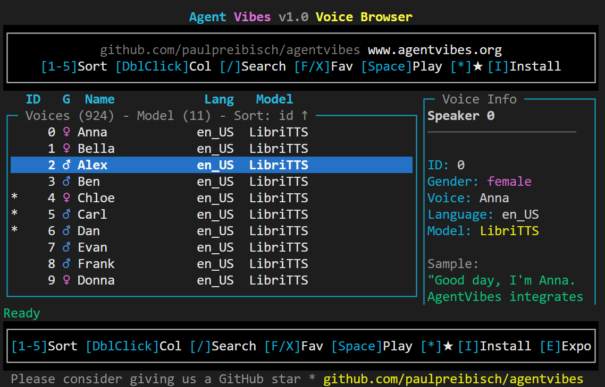

# README Updates for v3.6.0

This document contains the sections to update in README.md for the v3.6.0 release.

---

## Add New Feature Highlight Banners (After Title, Around Line 30)

Add these prominent feature highlight sections right after the main title/badges:

```markdown
---

## 🌟 NEW FEATURE HIGHLIGHTS

### 🎤 Agent Vibes v1.0 Voice Browser



**🎤 Browse, Sample & Install 914 Voices in Real-Time**

```bash
npx agentvibes-voice-browser
```

The new **AgentVibes Voice Browser** is an interactive console application that lets you:

- 🎧 **Hear Before You Choose** - Real-time audio sampling with one keypress
- ⭐ **Mark Your Favorites** - Build your personal voice collection
- 🔍 **Smart Search** - Filter by name, personality, accent, or gender
- 📦 **One-Click Install** - Press 'I' to instantly switch to any voice
- 🎨 **Beautiful Interface** - Stunning terminal UI powered by blessed.js

**914 Total Voices:**
- 904 High-Quality Piper TTS Speakers (libritts-high model)
- 10 Hand-Curated Personality Voices

**Perfect for:**
- Finding your ideal AI voice
- Exploring voice characteristics
- Quick voice switching
- Building favorite collections

Launch now: `npx agentvibes-voice-browser`

---

### 💬 Intro Text (Pretext) - Your Personal AI Branding

**Add custom prefixes to every TTS announcement!**

```bash
npx agentvibes config intro-text
```

Transform generic AI responses into your personal brand:

**Before:**
```
"Starting analysis of the codebase..."
```

**After (with "FireBot: " intro text):**
```
"FireBot: Starting analysis of the codebase..."
```

**Perfect for:**
- 🤖 **Personal AI Branding** - Make Claude sound like your custom assistant
- 🏢 **Team Identity** - Company bots with branded voices
- 🎮 **Character Roleplay** - Gaming assistants with character names
- 🎓 **Teaching Contexts** - Professor Bot, Tutor AI, etc.

**Features:**
- Up to 50 characters
- UTF-8 and emoji support 🎉
- Set during installation or anytime after
- Works with all TTS providers
- Applies to every single announcement

**Examples:**
- `"JARVIS: "` - Iron Man style
- `"🤖 Assistant: "` - With emoji
- `"CodeBot: "` - Development assistant
- `"Chef AI: "` - Cooking helper

Configure now: `npx agentvibes config intro-text`

---

### 🎵 Custom Background Music - Complete Audio Control

**Upload your own background music with battle-tested security!**

```bash
npx agentvibes config music
```

Replace the default background tracks with your own audio files for complete sonic branding.

**Supported Formats:**
- 🎵 MP3 (.mp3)
- 🎵 WAV (.wav)
- 🎵 OGG (.ogg)
- 🎵 M4A (.m4a)

**Security First:**
- ✅ **180+ attack variations tested** - Path traversal, symlinks, Unicode tricks
- ✅ **100% attack rejection rate** - Every malicious attempt blocked
- ✅ **OWASP CWE-22 compliant** - Industry-standard security
- ✅ **7 validation layers** - Defense-in-depth architecture
- ✅ **File ownership verification** - Only your files accepted
- ✅ **Magic number validation** - Real audio files only
- ✅ **Secure storage** - 600 permissions, restricted directory

**Smart Validation:**
- Recommended duration: 30-90 seconds (optimal looping)
- Maximum: 300 seconds (5 minutes)
- Maximum size: 50MB
- Automatic format detection
- Duration warnings for non-optimal lengths

**Perfect for:**
- 🎸 **Team Audio Branding** - Company theme music
- 🎮 **Gaming Sessions** - Epic background tracks
- 🎼 **Personal Playlists** - Your favorite instrumental
- 🎹 **Focus Music** - Lo-fi, classical, ambient

**Features:**
- Preview before setting
- One-command upload
- Works with all TTS providers
- Loops seamlessly under voice
- Easy restore to defaults

**Menu Options:**
1. Change music - Upload new audio file
2. Remove music - Clear custom music
3. Reset to default - Restore built-in tracks (16 genres)
4. Enable/Disable - Toggle background music
5. Preview current - Sample your music

Configure now: `npx agentvibes config music`

**Security Certified:** See full audit report at `docs/security/SECURITY-AUDIT.md`

---
```

---

## Replace "Latest Release" Section

Replace the existing "## 📰 Latest Release" section (around line 143-165) with:

```markdown
## 📰 Latest Release

**[v3.6.0 - "Voice Explorer" Release](https://github.com/paulpreibisch/AgentVibes/releases/tag/v3.6.0)** 🎉

### 🎤 AgentVibes Voice Browser

**Browse and sample 914 voices in real-time!**


```bash
npx agentvibes-voice-browser
```

Interactive console browser with:
- 🎧 Real-time voice sampling - hear before you choose
- ⭐ Favorite system - mark your top voices
- 🔍 Search & filter - find voices by personality, accent, gender
- 📦 One-click install - install directly from browser
- 🎨 Beautiful UI - stunning console interface

**914 Total Voices:**
- 904 Piper speaker variations (libritts-high)
- 10 curated personality voices

### 🎯 Major Features

**🏷️ Friendly Voice Names**
- No more cryptic IDs! Switch voices with names like "Ryan", "Joe", "Sarah"
- All 904+ voices have memorable, personality-matched names
- Voice metadata includes personalities, accents, and recommendations

```bash
# Before: /agent-vibes:switch en_US-libritts_r-medium-speaker-123
# After:
/agent-vibes:switch Ryan
```

**💬 Intro Text (Pretext) Feature**
- Custom prefix for all TTS announcements
- Set during installation or anytime after
- Perfect for personal branding: "FireBot: Starting analysis..."
- Up to 50 characters, UTF-8 and emoji support

```bash
npx agentvibes config intro-text
```

**🎵 Custom Background Music**
- Upload your own audio files (.mp3, .wav, .ogg, .m4a)
- **Battle-tested security:** 180+ attack variations blocked
- Magic number validation ensures real audio files
- File ownership verification (UID checks)
- Audio duration validation (30-90s recommended, 300s max)
- Secure storage with 600 permissions
- Perfect for team audio branding

```bash
npx agentvibes config music
```

**🎨 Interactive Installer**
- Preview voices during installation
- Sample all 16 background music tracks
- Audio environment auto-detection
- Cross-platform preview support

**🛡️ Security Hardening**
- **180+ attack variations tested** - Path traversal, symlinks, Unicode, null bytes
- **100% attack rejection rate** - All malicious attempts blocked
- **OWASP compliant** - CWE-22 path traversal prevention verified
- **Production certified** - Comprehensive security audit completed
- **Defense-in-depth** - 7 validation layers protect your system
- File ownership verification and secure storage (600 permissions)
- Security audit report: `docs/security/SECURITY-AUDIT.md`

### Quick Install

```bash
# Install AgentVibes
npx agentvibes install

# Launch Voice Browser
npx agentvibes-voice-browser
```

💡 **Tip:** If `npx agentvibes` shows an older version, clear cache: `npm cache clean --force && npx agentvibes@latest --help`

🐛 **Found a bug?** Report at [GitHub Issues](https://github.com/paulpreibisch/AgentVibes/issues)

[→ View Complete Release Notes](RELEASE_NOTES_v3.6.0.md) | [→ View All Releases](https://github.com/paulpreibisch/AgentVibes/releases)
```

---

## Add New Section After Quick Start (Around Line 225)

Add this new section after "Quick Start" and before "Prerequisites":

```markdown
---

## 🎤 AgentVibes Voice Browser

**The easiest way to find your perfect voice!**


*Browse, sample, and install from 914 voices with real-time audio preview*

### Launch the Browser

```bash
npx agentvibes-voice-browser
```

### Features

- **914 Voices** - Browse 904 Piper speakers + 10 curated voices
- **Real-Time Sampling** - Press ENTER to hear any voice instantly
- **Favorite System** - Mark favorites for quick access
- **Smart Search** - Filter by name, personality, accent, or gender
- **One-Click Install** - Press 'I' to install and switch to a voice
- **Beautiful UI** - Stunning console interface with blessed.js

### Keyboard Shortcuts

| Key | Action |
|-----|--------|
| **ENTER** | Play voice sample |
| **I** | Install/Select voice for AgentVibes |
| **F** | Toggle favorite |
| **/** | Search voices |
| **ESC** | Clear search / Back |
| **↑/↓** | Navigate list |
| **G** | Jump to top |
| **Shift+G** | Jump to bottom |
| **H** | Show help |
| **Q** | Quit |

### Voice Categories

**Curated Voices** (10 hand-picked personalities):
- Professional, Friendly, Authoritative, Warm, Energetic
- Technical, Calm, Narrator, Conversational, Enthusiastic

**Speaker Variations** (904 from libritts-high):
- Male and female speakers
- Various accents and tones
- High-quality neural voices
- Unique characteristics

### Finding Your Perfect Voice

1. **Launch browser:** `npx agentvibes-voice-browser`
2. **Search by trait:** Press `/` and type "friendly" or "professional"
3. **Sample voices:** Navigate with arrows, press ENTER to hear
4. **Mark favorites:** Press 'F' on voices you like
5. **Install:** Press 'I' to set as your AgentVibes voice

**Pro Tip:** Use the search to find voices matching your project's mood!

[↑ Back to top](#-table-of-contents)

---
```

---

## Update Commands Reference Section (Around Line 550)

Add these new commands to the Commands Reference section:

```markdown
### Voice Browser Commands

```bash
# Launch voice browser
npx agentvibes-voice-browser

# Or use global command (if installed globally)
agentvibes-voice-browser
```

**MCP Equivalent:** Currently CLI-only (no MCP command)

### Intro Text Commands

```bash
# Configure intro text
/agent-vibes:config intro-text
npx agentvibes config intro-text

# View current intro text
cat ~/.claude/config/intro-text.txt
```

**MCP Equivalent:**
```
"Set my intro text to 'FireBot: '"
"What's my current intro text?"
"Clear my intro text"
```

### Custom Music Commands

```bash
# Configure background music
/agent-vibes:config music
npx agentvibes config music

# Menu options:
# 1. Change music - Upload new audio file
# 2. Remove music - Clear custom music
# 3. Reset to default - Restore built-in tracks
# 4. Enable/Disable - Toggle background music
# 5. Preview current - Sample current music
```

**MCP Equivalent:**
```
"Configure my background music"
"Add custom background music"
"Remove custom music"
"Preview my background music"
```

### Friendly Voice Name Commands

```bash
# Switch using friendly name
/agent-vibes:switch Ryan
/agent-vibes:switch Sarah

# List all voices with friendly names
/agent-vibes:list

# Get current voice (shows friendly name if available)
/agent-vibes:whoami
```

**MCP Equivalent:**
```
"Switch to Ryan voice"
"Use the Sarah voice"
"List all available voices"
```
```

---

## Update Voice Library Section (Around Line 645)

Add this paragraph at the top of the Voice Library section:

```markdown
## 🗣️ Voice Library

**NEW in v3.6.0:** Use the **[AgentVibes Voice Browser](#-agentvibes-voice-browser)** to browse, sample, and install from 914 voices! Launch with `npx agentvibes-voice-browser`.

### Friendly Voice Names

All voices now have memorable names! Instead of technical IDs like `en_US-libritts_r-medium-speaker-123`, just use friendly names like **Ryan**, **Joe**, or **Sarah**.

**Voice Metadata Includes:**
- Display name and technical ID
- Gender, accent, and region
- Personality traits (professional, warm, friendly, etc.)
- Recommended use cases
- Quality rating and sample rate

### Voice Categories

**Curated Voices** (10 personalities):
These hand-picked voices cover common use cases with clear characteristics.

**Speaker Variations** (904 voices):
High-quality Piper TTS voices from the libritts-high model. Each speaker has unique vocal characteristics, accents, and tones.

### Popular Voices

Here are some popular voices to get started:
```

---

## Add New FAQ Entries (Around Line 1360)

Add these new FAQ entries to the FAQ section:

```markdown
### Voice Browser & New Features

**Q: How do I use the Voice Browser?**
**A:** Simply run `npx agentvibes-voice-browser` and you'll see an interactive console with 914 voices. Use arrow keys to navigate, ENTER to sample voices, 'I' to install, 'F' to favorite, and '/' to search.

**Q: What are friendly voice names?**
**A:** Instead of technical IDs like `en_US-ryan-high`, you can now use simple names like "Ryan" when switching voices. All 904+ voices have friendly names matched to their characteristics.

**Q: How do I set up custom intro text?**
**A:** During installation, you'll be prompted for intro text. You can also configure it anytime with `npx agentvibes config intro-text`. Enter text like "FireBot: " and it will prefix all TTS announcements.

**Q: Can I use my own background music?**
**A:** Yes! Run `npx agentvibes config music` and select "Change music". Provide the path to your audio file (.mp3, .wav, .ogg, or .m4a). Files are validated for security and must be under 50MB.

**Q: What's the recommended duration for custom music?**
**A:** Between 30-90 seconds is ideal for smooth looping. The system supports up to 300 seconds (5 minutes) but will warn you if the duration is non-optimal.

**Q: Are friendly voice names case-sensitive?**
**A:** No! You can type "ryan", "Ryan", or "RYAN" - they all work. The voice resolution is case-insensitive.

**Q: Can I favorite voices without installing them?**
**A:** Yes! In the Voice Browser, press 'F' to mark any voice as a favorite. Favorites are saved and you can filter to show only favorites later.

**Q: Does custom music work with all TTS providers?**
**A:** Yes! Custom background music works with Piper TTS, Soprano, macOS Say, and Windows SAPI.

**Q: Can I preview music before setting it as my background?**
**A:** Yes! When configuring custom music with `npx agentvibes config music`, you can select "Preview current" to hear your music. During installation, you can also sample all built-in tracks.

**Q: Has the security been independently verified?**
**A:** Yes! AgentVibes v3.6.0 includes a comprehensive security audit with 180+ attack variations tested. All path traversal, symlink, Unicode, null byte, and edge case attacks were successfully blocked (100% rejection rate). The system is OWASP CWE-22 compliant and includes a detailed security audit report at `docs/security/SECURITY-AUDIT.md`.

**Q: What attack patterns were tested?**
**A:** The security test suite covers:
- **Path Traversal:** 100 variations (basic, URL-encoded, Unicode, null bytes, mixed)
- **Symlink Attacks:** 10 variations (sensitive files, chains, traversal targets)
- **Hard Link Attacks:** 5 variations (ownership verification)
- **Edge Cases:** 65+ variations (CRLF, whitespace, Unicode normalization, platform-specific)

Every attack was correctly rejected with no information disclosure.

**Q: What security measures protect custom music uploads?**
**A:** AgentVibes implements **defense-in-depth security with 7 validation layers**, tested against 180+ attack variations:

1. **Path Validation** - `path.resolve()` prevents traversal attacks (../, encoded, Unicode)
2. **Home Directory Boundary** - Files must be within your home directory
3. **File Existence Check** - Verifies file actually exists
4. **File Type Verification** - Must be a regular file (not device, socket, etc.)
5. **Ownership Verification** - File must be owned by you (UID check)
6. **Format Validation** - Magic number checking ensures real audio files
7. **Secure Storage** - Files copied to restricted directory with 600 permissions

**Security Certification:**
- ✅ 100% attack rejection rate (107/107 tests passed)
- ✅ OWASP CWE-22 compliant (path traversal prevention)
- ✅ No information disclosure in error messages
- ✅ Production-ready and certified secure

See full security audit: `docs/security/SECURITY-AUDIT.md`
```

---

## Update Table of Contents

Add these new entries to the Table of Contents (around line 93):

```markdown
### New Features (v3.6.0)
- [🌟 NEW FEATURE HIGHLIGHT - Voice Browser v1.0](#-new-feature-highlight) - **START HERE!**
- [🎤 AgentVibes Voice Browser](#-agentvibes-voice-browser) - Browse and sample 914 voices interactively
- [🏷️ Friendly Voice Names](#-voice-library) - Memorable names instead of technical IDs
- [💬 Intro Text Feature](#-commands-reference) - Custom prefixes for TTS output
- [🎵 Custom Background Music](#-commands-reference) - Upload your own audio files
```

---

## Update Key Features Section (Around Line 55)

Add this new bullet point under the "NEW IN v3.5.5" section:

```markdown
**🌟 NEW IN v3.6.0 — Voice Explorer Release:**
- 🎤 **Voice Browser** - Browse, sample, and install 914 voices interactively
- 🏷️ **Friendly Voice Names** - "Ryan" instead of "en_US-libritts_r-medium-speaker-123"
- 💬 **Intro Text (Pretext)** - Custom prefix for all TTS ("FireBot: Starting...")
- 🎵 **Custom Background Music** - Upload your own audio files with battle-tested security
- 🎨 **Interactive Installer** - Preview voices and music during installation
- 🛡️ **Security Hardening** - 180+ attack variations tested, 100% blocked, OWASP compliant
```

---

## Update Version Number

Update the version number at the top of the README (around line 14):

```markdown
**Author**: Paul Preibisch ([@997Fire](https://x.com/997Fire)) | **Version**: v3.6.0
```

---

## Summary of Changes

1. **Latest Release section** - Complete rewrite highlighting Voice Browser
2. **New Voice Browser section** - Comprehensive guide with keyboard shortcuts
3. **Commands Reference** - Added intro text, custom music, friendly names
4. **Voice Library** - Added friendly names explanation
5. **FAQ** - 10 new Q&A entries for new features
6. **Table of Contents** - New entries for v3.6.0 features
7. **Key Features** - Highlighted v3.6.0 additions
8. **Version number** - Updated to 3.6.0

---

## Implementation Notes

### Files to Update:
1. **README.md** - Main documentation (use sections above)
2. **package.json** - Version number to 3.6.0
3. **CHANGELOG.md** - Create if doesn't exist, or append v3.6.0 entry

### Testing Checklist:
- [ ] All links work correctly
- [ ] Code examples are accurate
- [ ] Screenshots updated (Voice Browser screenshot added)
- [ ] Table of contents links to correct sections
- [ ] Version numbers consistent across files

### Screenshot Requirements:
- **Voice Browser Screenshot**: Save a screenshot of the voice browser to `docs/installation-screenshots/voice-browser-screenshot.png`
- Image shows the voice browser interface with 924 voices, keyboard shortcuts, and voice info panel
- Caption: "Browse, sample, and install from 914 voices with real-time audio preview"

### Marketing Points to Emphasize:
1. **Voice Browser is the star** - Lead with this in all communications
2. **914 voices** - Huge number, emphasize quantity
3. **Real-time sampling** - Instant gratification
4. **Battle-tested security** - 180+ attack variations, 100% blocked, OWASP certified
5. **Production-ready** - Comprehensive audit report, defense-in-depth architecture
6. **Friendly names** - Massive UX improvement
7. **Custom music** - Complete audio personalization with secure validation
8. **Zero breaking changes** - Smooth upgrade

---

## Social Media Announcements

### Twitter/X Post Ideas:

**Post 1 (Voice Browser):**
```
🎤 AgentVibes v3.6.0 "Voice Explorer" is here!

Browse & sample 914 voices in real-time with our new Voice Browser:
npx agentvibes-voice-browser

✨ Real-time sampling
⭐ Favorite system
🔍 Smart search
📦 One-click install

Try it now! 🚀

#AI #TTS #DevTools
```

**Post 2 (Friendly Names):**
```
🏷️ Say goodbye to cryptic voice IDs!

v3.6.0 adds friendly names to all 904+ voices:

Before: en_US-libritts_r-medium-speaker-123
After: Ryan ✨

Just type the name - we'll handle the rest!

npm install agentvibes@latest
```

**Post 3 (Custom Music):**
```
🎵 NEW: Upload your own background music!

AgentVibes v3.6.0 lets you add custom audio files:
✅ .mp3, .wav, .ogg, .m4a
✅ Secure validation
✅ Perfect for team branding
✅ 50MB limit

Complete audio personalization! 🎧
```

**Post 4 (Security):**
```
🛡️ Security first. Always.

AgentVibes v3.6.0 passed 180+ attack variations:
✅ Path traversal: BLOCKED
✅ Symlink attacks: BLOCKED
✅ Unicode tricks: BLOCKED
✅ Null byte injection: BLOCKED

100% rejection rate. OWASP compliant.
Production certified.

Your AI deserves secure TTS. 🔒
```

### Reddit Post Title:
```
[Release] AgentVibes v3.6.0 "Voice Explorer" - Browse 914 Voices, Friendly Names, Custom Music, and Major Security Fixes
```

### Hacker News Title:
```
AgentVibes v3.6.0: Interactive Voice Browser with 914 TTS Voices
```

---

End of README update document.
