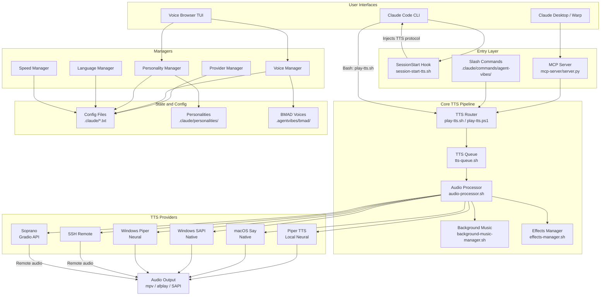
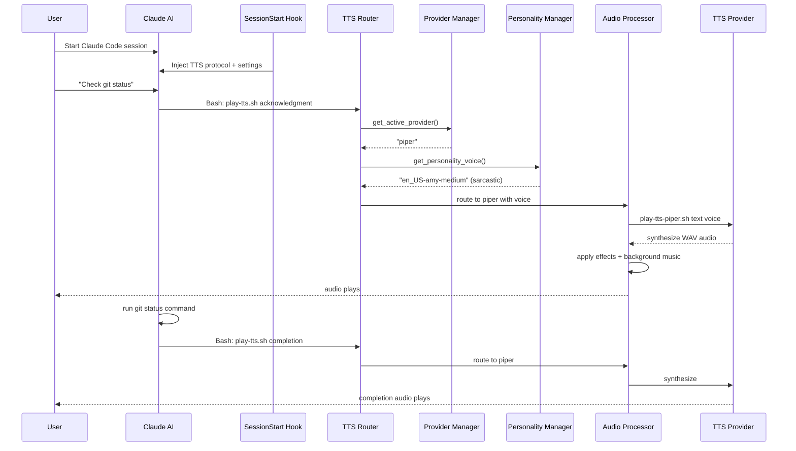
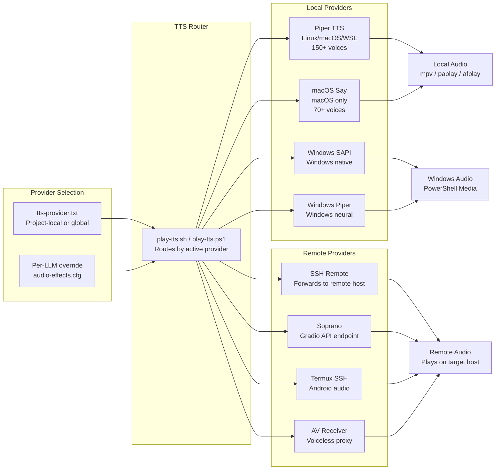

# AgentVibes Architecture Diagrams

> Generated: 2026-05-18 | Version: 5.7.7
> These diagrams render inline on GitHub. Click any mermaid.ink link for a standalone PNG.

---

## Diagram 1: System Architecture Overview

[![System Architecture](https://mermaid.ink/img/Z3JhcGggVEIKICAgIHN1YmdyYXBoIFVJWyJVc2VyIEludGVyZmFjZXMiXQogICAgICAgIENDWyJDbGF1ZGUgQ29kZSBDTEkiXQogICAgICAgIENEWyJDbGF1ZGUgRGVza3RvcCAvIFdhcnAiXQogICAgICAgIFRVSVsiVm9pY2UgQnJvd3NlciBUVUkiXQogICAgZW5kCiAgICBzdWJncmFwaCBFbnRyeVsiRW50cnkgTGF5ZXIiXQogICAgICAgIEhPT0tbIlNlc3Npb25TdGFydCBIb29rXG5zZXNzaW9uLXN0YXJ0LXR0cy5zaCJdCiAgICAgICAgTUNQWyJNQ1AgU2VydmVyXG5tY3Atc2VydmVyL3NlcnZlci5weSJdCiAgICAgICAgU0xBU0hbIlNsYXNoIENvbW1hbmRzXG4uY2xhdWRlL2NvbW1hbmRzL2FnZW50LXZpYmVzLyJdCiAgICBlbmQKICAgIHN1YmdyYXBoIENvcmVbIkNvcmUgVFRTIFBpcGVsaW5lIl0KICAgICAgICBST1VURVJbIlRUUyBSb3V0ZXJcbnBsYXktdHRzLnNoIC8gcGxheS10dHMucHMxIl0KICAgICAgICBRVUVVRVsiVFRTIFF1ZXVlXG50dHMtcXVldWUuc2giXQogICAgICAgIEFQWyJBdWRpbyBQcm9jZXNzb3JcbmF1ZGlvLXByb2Nlc3Nvci5zaCJdCiAgICAgICAgQkdbIkJhY2tncm91bmQgTXVzaWNcbmJhY2tncm91bmQtbXVzaWMtbWFuYWdlci5zaCJdCiAgICAgICAgRlhbIkVmZmVjdHMgTWFuYWdlclxuZWZmZWN0cy1tYW5hZ2VyLnNoIl0KICAgIGVuZAogICAgc3ViZ3JhcGggTWdtdFsiTWFuYWdlcnMiXQogICAgICAgIFBNWyJQcm92aWRlciBNYW5hZ2VyIl0KICAgICAgICBWTVsiVm9pY2UgTWFuYWdlciJdCiAgICAgICAgUEVSU1siUGVyc29uYWxpdHkgTWFuYWdlciJdCiAgICAgICAgTEFOR1siTGFuZ3VhZ2UgTWFuYWdlciJdCiAgICAgICAgU1BEWyJTcGVlZCBNYW5hZ2VyIl0KICAgIGVuZAogICAgc3ViZ3JhcGggUHJvdmlkZXJzWyJUVFMgUHJvdmlkZXJzIl0KICAgICAgICBQSVBFUlsiUGlwZXIgVFRTXG5Mb2NhbCBOZXVyYWwiXQogICAgICAgIE1BQ09TWyJtYWNPUyBTYXlcbk5hdGl2ZSJdCiAgICAgICAgU0FQSVsiV2luZG93cyBTQVBJXG5OYXRpdmUiXQogICAgICAgIFdQSVBbIldpbmRvd3MgUGlwZXJcbk5ldXJhbCJdCiAgICAgICAgU1NIWyJTU0ggUmVtb3RlIl0KICAgICAgICBTT1BbIlNvcHJhbm9cbkdyYWRpbyBBUEkiXQogICAgZW5kCiAgICBzdWJncmFwaCBDb25maWdbIlN0YXRlIGFuZCBDb25maWciXQogICAgICAgIFRYVFsiQ29uZmlnIEZpbGVzXG4uY2xhdWRlLyoudHh0Il0KICAgICAgICBQRklMRVNbIlBlcnNvbmFsaXRpZXNcbi5jbGF1ZGUvcGVyc29uYWxpdGllcy8iXQogICAgICAgIEJNQURbIkJNQUQgVm9pY2VzXG4uYWdlbnR2aWJlcy9ibWFkLyJdCiAgICBlbmQKICAgIEFVRElPWyJBdWRpbyBPdXRwdXRcbm1wdiAvIGFmcGxheSAvIFNBUEkiXQogICAgQ0MgLS0+IEhPT0sKICAgIEhPT0sgLS0+fCJJbmplY3RzIFRUUyBwcm90b2NvbCJ8IENDCiAgICBDRCAtLT4gTUNQCiAgICBUVUkgLS0+IFZNICYgUEVSUwogICAgTUNQIC0tPiBST1VURVIKICAgIFNMQVNIIC0tPiBST1VURVIKICAgIENDIC0tPnwiQmFzaDogcGxheS10dHMuc2gifCBST1VURVIKICAgIFJPVVRFUiAtLT4gUVVFVUUgLS0+IEFQCiAgICBBUCAtLT4gQkcgJiBGWAogICAgQVAgLS0+IFBJUEVSICYgTUFDT1MgJiBTQVBJICYgV1BJUCAmIFNTSCAmIFNPUAogICAgUE0gJiBWTSAmIFBFUlMgJiBMQU5HICYgU1BEIC0tPiBUWFQKICAgIFBFUlMgLS0+IFBGSUxFUwogICAgVk0gLS0+IEJNQUQKICAgIFBJUEVSICYgTUFDT1MgJiBTQVBJICYgV1BJUCAtLT4gQVVESU8KICAgIFNTSCAmIFNPUCAtLT58IlJlbW90ZSBhdWRpbyJ8IEFVRElP)](https://mermaid.ink/img/Z3JhcGggVEIKICAgIHN1YmdyYXBoIFVJWyJVc2VyIEludGVyZmFjZXMiXQogICAgICAgIENDWyJDbGF1ZGUgQ29kZSBDTEkiXQogICAgICAgIENEWyJDbGF1ZGUgRGVza3RvcCAvIFdhcnAiXQogICAgICAgIFRVSVsiVm9pY2UgQnJvd3NlciBUVUkiXQogICAgZW5kCiAgICBzdWJncmFwaCBFbnRyeVsiRW50cnkgTGF5ZXIiXQogICAgICAgIEhPT0tbIlNlc3Npb25TdGFydCBIb29rXG5zZXNzaW9uLXN0YXJ0LXR0cy5zaCJdCiAgICAgICAgTUNQWyJNQ1AgU2VydmVyXG5tY3Atc2VydmVyL3NlcnZlci5weSJdCiAgICAgICAgU0xBU0hbIlNsYXNoIENvbW1hbmRzXG4uY2xhdWRlL2NvbW1hbmRzL2FnZW50LXZpYmVzLyJdCiAgICBlbmQKICAgIHN1YmdyYXBoIENvcmVbIkNvcmUgVFRTIFBpcGVsaW5lIl0KICAgICAgICBST1VURVJbIlRUUyBSb3V0ZXJcbnBsYXktdHRzLnNoIC8gcGxheS10dHMucHMxIl0KICAgICAgICBRVUVVRVsiVFRTIFF1ZXVlXG50dHMtcXVldWUuc2giXQogICAgICAgIEFQWyJBdWRpbyBQcm9jZXNzb3JcbmF1ZGlvLXByb2Nlc3Nvci5zaCJdCiAgICAgICAgQkdbIkJhY2tncm91bmQgTXVzaWNcbmJhY2tncm91bmQtbXVzaWMtbWFuYWdlci5zaCJdCiAgICAgICAgRlhbIkVmZmVjdHMgTWFuYWdlclxuZWZmZWN0cy1tYW5hZ2VyLnNoIl0KICAgIGVuZAogICAgc3ViZ3JhcGggTWdtdFsiTWFuYWdlcnMiXQogICAgICAgIFBNWyJQcm92aWRlciBNYW5hZ2VyIl0KICAgICAgICBWTVsiVm9pY2UgTWFuYWdlciJdCiAgICAgICAgUEVSU1siUGVyc29uYWxpdHkgTWFuYWdlciJdCiAgICAgICAgTEFOR1siTGFuZ3VhZ2UgTWFuYWdlciJdCiAgICAgICAgU1BEWyJTcGVlZCBNYW5hZ2VyIl0KICAgIGVuZAogICAgc3ViZ3JhcGggUHJvdmlkZXJzWyJUVFMgUHJvdmlkZXJzIl0KICAgICAgICBQSVBFUlsiUGlwZXIgVFRTXG5Mb2NhbCBOZXVyYWwiXQogICAgICAgIE1BQ09TWyJtYWNPUyBTYXlcbk5hdGl2ZSJdCiAgICAgICAgU0FQSVsiV2luZG93cyBTQVBJXG5OYXRpdmUiXQogICAgICAgIFdQSVBbIldpbmRvd3MgUGlwZXJcbk5ldXJhbCJdCiAgICAgICAgU1NIWyJTU0ggUmVtb3RlIl0KICAgICAgICBTT1BbIlNvcHJhbm9cbkdyYWRpbyBBUEkiXQogICAgZW5kCiAgICBzdWJncmFwaCBDb25maWdbIlN0YXRlIGFuZCBDb25maWciXQogICAgICAgIFRYVFsiQ29uZmlnIEZpbGVzXG4uY2xhdWRlLyoudHh0Il0KICAgICAgICBQRklMRVNbIlBlcnNvbmFsaXRpZXNcbi5jbGF1ZGUvcGVyc29uYWxpdGllcy8iXQogICAgICAgIEJNQURbIkJNQUQgVm9pY2VzXG4uYWdlbnR2aWJlcy9ibWFkLyJdCiAgICBlbmQKICAgIEFVRElPWyJBdWRpbyBPdXRwdXRcbm1wdiAvIGFmcGxheSAvIFNBUEkiXQogICAgQ0MgLS0+IEhPT0sKICAgIEhPT0sgLS0+fCJJbmplY3RzIFRUUyBwcm90b2NvbCJ8IENDCiAgICBDRCAtLT4gTUNQCiAgICBUVUkgLS0+IFZNICYgUEVSUwogICAgTUNQIC0tPiBST1VURVIKICAgIFNMQVNIIC0tPiBST1VURVIKICAgIENDIC0tPnwiQmFzaDogcGxheS10dHMuc2gifCBST1VURVIKICAgIFJPVVRFUiAtLT4gUVVFVUUgLS0+IEFQCiAgICBBUCAtLT4gQkcgJiBGWAogICAgQVAgLS0+IFBJUEVSICYgTUFDT1MgJiBTQVBJICYgV1BJUCAmIFNTSCAmIFNPUAogICAgUE0gJiBWTSAmIFBFUlMgJiBMQU5HICYgU1BEIC0tPiBUWFQKICAgIFBFUlMgLS0+IFBGSUxFUwogICAgVk0gLS0+IEJNQUQKICAgIFBJUEVSICYgTUFDT1MgJiBTQVBJICYgV1BJUCAtLT4gQVVESU8KICAgIFNTSCAmIFNPUCAtLT58IlJlbW90ZSBhdWRpbyJ8IEFVRElP)

**Direct PNG link:** https://mermaid.ink/img/Z3JhcGggVEIKICAgIHN1YmdyYXBoIFVJWyJVc2VyIEludGVyZmFjZXMiXQogICAgICAgIENDWyJDbGF1ZGUgQ29kZSBDTEkiXQogICAgICAgIENEWyJDbGF1ZGUgRGVza3RvcCAvIFdhcnAiXQogICAgICAgIFRVSVsiVm9pY2UgQnJvd3NlciBUVUkiXQogICAgZW5kCiAgICBzdWJncmFwaCBFbnRyeVsiRW50cnkgTGF5ZXIiXQogICAgICAgIEhPT0tbIlNlc3Npb25TdGFydCBIb29rXG5zZXNzaW9uLXN0YXJ0LXR0cy5zaCJdCiAgICAgICAgTUNQWyJNQ1AgU2VydmVyXG5tY3Atc2VydmVyL3NlcnZlci5weSJdCiAgICAgICAgU0xBU0hbIlNsYXNoIENvbW1hbmRzXG4uY2xhdWRlL2NvbW1hbmRzL2FnZW50LXZpYmVzLyJdCiAgICBlbmQKICAgIHN1YmdyYXBoIENvcmVbIkNvcmUgVFRTIFBpcGVsaW5lIl0KICAgICAgICBST1VURVJbIlRUUyBSb3V0ZXJcbnBsYXktdHRzLnNoIC8gcGxheS10dHMucHMxIl0KICAgICAgICBRVUVVRVsiVFRTIFF1ZXVlXG50dHMtcXVldWUuc2giXQogICAgICAgIEFQWyJBdWRpbyBQcm9jZXNzb3JcbmF1ZGlvLXByb2Nlc3Nvci5zaCJdCiAgICAgICAgQkdbIkJhY2tncm91bmQgTXVzaWNcbmJhY2tncm91bmQtbXVzaWMtbWFuYWdlci5zaCJdCiAgICAgICAgRlhbIkVmZmVjdHMgTWFuYWdlclxuZWZmZWN0cy1tYW5hZ2VyLnNoIl0KICAgIGVuZAogICAgc3ViZ3JhcGggTWdtdFsiTWFuYWdlcnMiXQogICAgICAgIFBNWyJQcm92aWRlciBNYW5hZ2VyIl0KICAgICAgICBWTVsiVm9pY2UgTWFuYWdlciJdCiAgICAgICAgUEVSU1siUGVyc29uYWxpdHkgTWFuYWdlciJdCiAgICAgICAgTEFOR1siTGFuZ3VhZ2UgTWFuYWdlciJdCiAgICAgICAgU1BEWyJTcGVlZCBNYW5hZ2VyIl0KICAgIGVuZAogICAgc3ViZ3JhcGggUHJvdmlkZXJzWyJUVFMgUHJvdmlkZXJzIl0KICAgICAgICBQSVBFUlsiUGlwZXIgVFRTXG5Mb2NhbCBOZXVyYWwiXQogICAgICAgIE1BQ09TWyJtYWNPUyBTYXlcbk5hdGl2ZSJdCiAgICAgICAgU0FQSVsiV2luZG93cyBTQVBJXG5OYXRpdmUiXQogICAgICAgIFdQSVBbIldpbmRvd3MgUGlwZXJcbk5ldXJhbCJdCiAgICAgICAgU1NIWyJTU0ggUmVtb3RlIl0KICAgICAgICBTT1BbIlNvcHJhbm9cbkdyYWRpbyBBUEkiXQogICAgZW5kCiAgICBzdWJncmFwaCBDb25maWdbIlN0YXRlIGFuZCBDb25maWciXQogICAgICAgIFRYVFsiQ29uZmlnIEZpbGVzXG4uY2xhdWRlLyoudHh0Il0KICAgICAgICBQRklMRVNbIlBlcnNvbmFsaXRpZXNcbi5jbGF1ZGUvcGVyc29uYWxpdGllcy8iXQogICAgICAgIEJNQURbIkJNQUQgVm9pY2VzXG4uYWdlbnR2aWJlcy9ibWFkLyJdCiAgICBlbmQKICAgIEFVRElPWyJBdWRpbyBPdXRwdXRcbm1wdiAvIGFmcGxheSAvIFNBUEkiXQogICAgQ0MgLS0+IEhPT0sKICAgIEhPT0sgLS0+fCJJbmplY3RzIFRUUyBwcm90b2NvbCJ8IENDCiAgICBDRCAtLT4gTUNQCiAgICBUVUkgLS0+IFZNICYgUEVSUwogICAgTUNQIC0tPiBST1VURVIKICAgIFNMQVNIIC0tPiBST1VURVIKICAgIENDIC0tPnwiQmFzaDogcGxheS10dHMuc2gifCBST1VURVIKICAgIFJPVVRFUiAtLT4gUVVFVUUgLS0+IEFQCiAgICBBUCAtLT4gQkcgJiBGWAogICAgQVAgLS0+IFBJUEVSICYgTUFDT1MgJiBTQVBJICYgV1BJUCAmIFNTSCAmIFNPUAogICAgUE0gJiBWTSAmIFBFUlMgJiBMQU5HICYgU1BEIC0tPiBUWFQKICAgIFBFUlMgLS0+IFBGSUxFUwogICAgVk0gLS0+IEJNQUQKICAgIFBJUEVSICYgTUFDT1MgJiBTQVBJICYgV1BJUCAtLT4gQVVESU8KICAgIFNTSCAmIFNPUCAtLT58IlJlbW90ZSBhdWRpbyJ8IEFVRElP

---

## Diagram 2: TTS Request Flow (Sequence)

[![TTS Request Sequence](https://mermaid.ink/img/c2VxdWVuY2VEaWFncmFtCiAgICBwYXJ0aWNpcGFudCBVIGFzIFVzZXIKICAgIHBhcnRpY2lwYW50IEFJIGFzIENsYXVkZSBBSQogICAgcGFydGljaXBhbnQgSCBhcyBTZXNzaW9uU3RhcnQgSG9vawogICAgcGFydGljaXBhbnQgUiBhcyBUVFMgUm91dGVyCiAgICBwYXJ0aWNpcGFudCBQTSBhcyBQcm92aWRlciBNYW5hZ2VyCiAgICBwYXJ0aWNpcGFudCBQRVJTIGFzIFBlcnNvbmFsaXR5IE1hbmFnZXIKICAgIHBhcnRpY2lwYW50IEFQIGFzIEF1ZGlvIFByb2Nlc3NvcgogICAgcGFydGljaXBhbnQgUCBhcyBUVFMgUHJvdmlkZXIKICAgIFUtPj5BSTogU3RhcnQgQ2xhdWRlIENvZGUgc2Vzc2lvbgogICAgSC0+PkFJOiBJbmplY3QgVFRTIHByb3RvY29sICsgc2V0dGluZ3MKICAgIFUtPj5BSTogIkNoZWNrIGdpdCBzdGF0dXMiCiAgICBBSS0+PlI6IEJhc2g6IHBsYXktdHRzLnNoIGFja25vd2xlZGdtZW50CiAgICBSLT4+UE06IGdldF9hY3RpdmVfcHJvdmlkZXIoKQogICAgUE0tLT4+UjogInBpcGVyIgogICAgUi0+PlBFUlM6IGdldF9wZXJzb25hbGl0eV92b2ljZSgpCiAgICBQRVJTLS0+PlI6ICJlbl9VUy1hbXktbWVkaXVtIiAoc2FyY2FzdGljKQogICAgUi0+PkFQOiByb3V0ZSB0byBwaXBlciB3aXRoIHZvaWNlCiAgICBBUC0+PlA6IHBsYXktdHRzLXBpcGVyLnNoIHRleHQgdm9pY2UKICAgIFAtLT4+QVA6IHN5bnRoZXNpemUgV0FWIGF1ZGlvCiAgICBBUC0+PkFQOiBhcHBseSBlZmZlY3RzICsgYmFja2dyb3VuZCBtdXNpYwogICAgQVAtLT4+VTogYXVkaW8gcGxheXMKICAgIEFJLT4+QUk6IHJ1biBnaXQgc3RhdHVzIGNvbW1hbmQKICAgIEFJLT4+UjogQmFzaDogcGxheS10dHMuc2ggY29tcGxldGlvbgogICAgUi0+PkFQOiByb3V0ZSB0byBwaXBlcgogICAgQVAtPj5QOiBzeW50aGVzaXplCiAgICBQLS0+PlU6IGNvbXBsZXRpb24gYXVkaW8gcGxheXM=)](https://mermaid.ink/img/c2VxdWVuY2VEaWFncmFtCiAgICBwYXJ0aWNpcGFudCBVIGFzIFVzZXIKICAgIHBhcnRpY2lwYW50IEFJIGFzIENsYXVkZSBBSQogICAgcGFydGljaXBhbnQgSCBhcyBTZXNzaW9uU3RhcnQgSG9vawogICAgcGFydGljaXBhbnQgUiBhcyBUVFMgUm91dGVyCiAgICBwYXJ0aWNpcGFudCBQTSBhcyBQcm92aWRlciBNYW5hZ2VyCiAgICBwYXJ0aWNpcGFudCBQRVJTIGFzIFBlcnNvbmFsaXR5IE1hbmFnZXIKICAgIHBhcnRpY2lwYW50IEFQIGFzIEF1ZGlvIFByb2Nlc3NvcgogICAgcGFydGljaXBhbnQgUCBhcyBUVFMgUHJvdmlkZXIKICAgIFUtPj5BSTogU3RhcnQgQ2xhdWRlIENvZGUgc2Vzc2lvbgogICAgSC0+PkFJOiBJbmplY3QgVFRTIHByb3RvY29sICsgc2V0dGluZ3MKICAgIFUtPj5BSTogIkNoZWNrIGdpdCBzdGF0dXMiCiAgICBBSS0+PlI6IEJhc2g6IHBsYXktdHRzLnNoIGFja25vd2xlZGdtZW50CiAgICBSLT4+UE06IGdldF9hY3RpdmVfcHJvdmlkZXIoKQogICAgUE0tLT4+UjogInBpcGVyIgogICAgUi0+PlBFUlM6IGdldF9wZXJzb25hbGl0eV92b2ljZSgpCiAgICBQRVJTLS0+PlI6ICJlbl9VUy1hbXktbWVkaXVtIiAoc2FyY2FzdGljKQogICAgUi0+PkFQOiByb3V0ZSB0byBwaXBlciB3aXRoIHZvaWNlCiAgICBBUC0+PlA6IHBsYXktdHRzLXBpcGVyLnNoIHRleHQgdm9pY2UKICAgIFAtLT4+QVA6IHN5bnRoZXNpemUgV0FWIGF1ZGlvCiAgICBBUC0+PkFQOiBhcHBseSBlZmZlY3RzICsgYmFja2dyb3VuZCBtdXNpYwogICAgQVAtLT4+VTogYXVkaW8gcGxheXMKICAgIEFJLT4+QUk6IHJ1biBnaXQgc3RhdHVzIGNvbW1hbmQKICAgIEFJLT4+UjogQmFzaDogcGxheS10dHMuc2ggY29tcGxldGlvbgogICAgUi0+PkFQOiByb3V0ZSB0byBwaXBlcgogICAgQVAtPj5QOiBzeW50aGVzaXplCiAgICBQLS0+PlU6IGNvbXBsZXRpb24gYXVkaW8gcGxheXM=)

**Direct PNG link:** https://mermaid.ink/img/c2VxdWVuY2VEaWFncmFtCiAgICBwYXJ0aWNpcGFudCBVIGFzIFVzZXIKICAgIHBhcnRpY2lwYW50IEFJIGFzIENsYXVkZSBBSQogICAgcGFydGljaXBhbnQgSCBhcyBTZXNzaW9uU3RhcnQgSG9vawogICAgcGFydGljaXBhbnQgUiBhcyBUVFMgUm91dGVyCiAgICBwYXJ0aWNpcGFudCBQTSBhcyBQcm92aWRlciBNYW5hZ2VyCiAgICBwYXJ0aWNpcGFudCBQRVJTIGFzIFBlcnNvbmFsaXR5IE1hbmFnZXIKICAgIHBhcnRpY2lwYW50IEFQIGFzIEF1ZGlvIFByb2Nlc3NvcgogICAgcGFydGljaXBhbnQgUCBhcyBUVFMgUHJvdmlkZXIKICAgIFUtPj5BSTogU3RhcnQgQ2xhdWRlIENvZGUgc2Vzc2lvbgogICAgSC0+PkFJOiBJbmplY3QgVFRTIHByb3RvY29sICsgc2V0dGluZ3MKICAgIFUtPj5BSTogIkNoZWNrIGdpdCBzdGF0dXMiCiAgICBBSS0+PlI6IEJhc2g6IHBsYXktdHRzLnNoIGFja25vd2xlZGdtZW50CiAgICBSLT4+UE06IGdldF9hY3RpdmVfcHJvdmlkZXIoKQogICAgUE0tLT4+UjogInBpcGVyIgogICAgUi0+PlBFUlM6IGdldF9wZXJzb25hbGl0eV92b2ljZSgpCiAgICBQRVJTLS0+PlI6ICJlbl9VUy1hbXktbWVkaXVtIiAoc2FyY2FzdGljKQogICAgUi0+PkFQOiByb3V0ZSB0byBwaXBlciB3aXRoIHZvaWNlCiAgICBBUC0+PlA6IHBsYXktdHRzLXBpcGVyLnNoIHRleHQgdm9pY2UKICAgIFAtLT4+QVA6IHN5bnRoZXNpemUgV0FWIGF1ZGlvCiAgICBBUC0+PkFQOiBhcHBseSBlZmZlY3RzICsgYmFja2dyb3VuZCBtdXNpYwogICAgQVAtLT4+VTogYXVkaW8gcGxheXMKICAgIEFJLT4+QUk6IHJ1biBnaXQgc3RhdHVzIGNvbW1hbmQKICAgIEFJLT4+UjogQmFzaDogcGxheS10dHMuc2ggY29tcGxldGlvbgogICAgUi0+PkFQOiByb3V0ZSB0byBwaXBlcgogICAgQVAtPj5QOiBzeW50aGVzaXplCiAgICBQLS0+PlU6IGNvbXBsZXRpb24gYXVkaW8gcGxheXM=

---

## Diagram 3: Provider Architecture

[![Provider Architecture](https://mermaid.ink/img/Z3JhcGggTFIKICAgIHN1YmdyYXBoIFJvdXRlclsiVFRTIFJvdXRlciJdCiAgICAgICAgUlsicGxheS10dHMuc2ggLyBwbGF5LXR0cy5wczFcblJvdXRlcyBieSBhY3RpdmUgcHJvdmlkZXIiXQogICAgZW5kCiAgICBzdWJncmFwaCBMb2NhbFsiTG9jYWwgUHJvdmlkZXJzIl0KICAgICAgICBQMVsiUGlwZXIgVFRTXG5MaW51eC9tYWNPUy9XU0xcbjE1MCsgdm9pY2VzIl0KICAgICAgICBQMlsibWFjT1MgU2F5XG5tYWNPUyBvbmx5XG43MCsgdm9pY2VzIl0KICAgICAgICBQM1siV2luZG93cyBTQVBJXG5XaW5kb3dzIG5hdGl2ZSJdCiAgICAgICAgUDRbIldpbmRvd3MgUGlwZXJcbldpbmRvd3MgbmV1cmFsIl0KICAgIGVuZAogICAgc3ViZ3JhcGggUmVtb3RlWyJSZW1vdGUgUHJvdmlkZXJzIl0KICAgICAgICBQNVsiU1NIIFJlbW90ZVxuRm9yd2FyZHMgdG8gcmVtb3RlIGhvc3QiXQogICAgICAgIFA2WyJTb3ByYW5vXG5HcmFkaW8gQVBJIGVuZHBvaW50Il0KICAgICAgICBQN1siVGVybXV4IFNTSFxuQW5kcm9pZCBhdWRpbyJdCiAgICAgICAgUDhbIkFWIFJlY2VpdmVyXG5Wb2ljZWxlc3MgcHJveHkiXQogICAgZW5kCiAgICBzdWJncmFwaCBTdGF0ZVsiUHJvdmlkZXIgU2VsZWN0aW9uIl0KICAgICAgICBUWyJ0dHMtcHJvdmlkZXIudHh0XG5Qcm9qZWN0LWxvY2FsIG9yIGdsb2JhbCJdCiAgICAgICAgUEZbIlBlci1MTE0gb3ZlcnJpZGVcbmF1ZGlvLWVmZmVjdHMuY2ZnIl0KICAgIGVuZAogICAgVCAtLT4gUgogICAgUEYgLS0+IFIKICAgIFIgLS0+IFAxICYgUDIgJiBQMyAmIFA0CiAgICBSIC0tPiBQNSAmIFA2ICYgUDcgJiBQOAogICAgUDEgJiBQMiAtLT4gQTFbIkxvY2FsIEF1ZGlvXG5tcHYgLyBwYXBsYXkgLyBhZnBsYXkiXQogICAgUDMgJiBQNCAtLT4gQTJbIldpbmRvd3MgQXVkaW9cblBvd2VyU2hlbGwgTWVkaWEiXQogICAgUDUgJiBQNiAmIFA3ICYgUDggLS0+IEEzWyJSZW1vdGUgQXVkaW9cblBsYXlzIG9uIHRhcmdldCBob3N0Il0=)](https://mermaid.ink/img/Z3JhcGggTFIKICAgIHN1YmdyYXBoIFJvdXRlclsiVFRTIFJvdXRlciJdCiAgICAgICAgUlsicGxheS10dHMuc2ggLyBwbGF5LXR0cy5wczFcblJvdXRlcyBieSBhY3RpdmUgcHJvdmlkZXIiXQogICAgZW5kCiAgICBzdWJncmFwaCBMb2NhbFsiTG9jYWwgUHJvdmlkZXJzIl0KICAgICAgICBQMVsiUGlwZXIgVFRTXG5MaW51eC9tYWNPUy9XU0xcbjE1MCsgdm9pY2VzIl0KICAgICAgICBQMlsibWFjT1MgU2F5XG5tYWNPUyBvbmx5XG43MCsgdm9pY2VzIl0KICAgICAgICBQM1siV2luZG93cyBTQVBJXG5XaW5kb3dzIG5hdGl2ZSJdCiAgICAgICAgUDRbIldpbmRvd3MgUGlwZXJcbldpbmRvd3MgbmV1cmFsIl0KICAgIGVuZAogICAgc3ViZ3JhcGggUmVtb3RlWyJSZW1vdGUgUHJvdmlkZXJzIl0KICAgICAgICBQNVsiU1NIIFJlbW90ZVxuRm9yd2FyZHMgdG8gcmVtb3RlIGhvc3QiXQogICAgICAgIFA2WyJTb3ByYW5vXG5HcmFkaW8gQVBJIGVuZHBvaW50Il0KICAgICAgICBQN1siVGVybXV4IFNTSFxuQW5kcm9pZCBhdWRpbyJdCiAgICAgICAgUDhbIkFWIFJlY2VpdmVyXG5Wb2ljZWxlc3MgcHJveHkiXQogICAgZW5kCiAgICBzdWJncmFwaCBTdGF0ZVsiUHJvdmlkZXIgU2VsZWN0aW9uIl0KICAgICAgICBUWyJ0dHMtcHJvdmlkZXIudHh0XG5Qcm9qZWN0LWxvY2FsIG9yIGdsb2JhbCJdCiAgICAgICAgUEZbIlBlci1MTE0gb3ZlcnJpZGVcbmF1ZGlvLWVmZmVjdHMuY2ZnIl0KICAgIGVuZAogICAgVCAtLT4gUgogICAgUEYgLS0+IFIKICAgIFIgLS0+IFAxICYgUDIgJiBQMyAmIFA0CiAgICBSIC0tPiBQNSAmIFA2ICYgUDcgJiBQOAogICAgUDEgJiBQMiAtLT4gQTFbIkxvY2FsIEF1ZGlvXG5tcHYgLyBwYXBsYXkgLyBhZnBsYXkiXQogICAgUDMgJiBQNCAtLT4gQTJbIldpbmRvd3MgQXVkaW9cblBvd2VyU2hlbGwgTWVkaWEiXQogICAgUDUgJiBQNiAmIFA3ICYgUDggLS0+IEEzWyJSZW1vdGUgQXVkaW9cblBsYXlzIG9uIHRhcmdldCBob3N0Il0=)

**Direct PNG link:** https://mermaid.ink/img/Z3JhcGggTFIKICAgIHN1YmdyYXBoIFJvdXRlclsiVFRTIFJvdXRlciJdCiAgICAgICAgUlsicGxheS10dHMuc2ggLyBwbGF5LXR0cy5wczFcblJvdXRlcyBieSBhY3RpdmUgcHJvdmlkZXIiXQogICAgZW5kCiAgICBzdWJncmFwaCBMb2NhbFsiTG9jYWwgUHJvdmlkZXJzIl0KICAgICAgICBQMVsiUGlwZXIgVFRTXG5MaW51eC9tYWNPUy9XU0xcbjE1MCsgdm9pY2VzIl0KICAgICAgICBQMlsibWFjT1MgU2F5XG5tYWNPUyBvbmx5XG43MCsgdm9pY2VzIl0KICAgICAgICBQM1siV2luZG93cyBTQVBJXG5XaW5kb3dzIG5hdGl2ZSJdCiAgICAgICAgUDRbIldpbmRvd3MgUGlwZXJcbldpbmRvd3MgbmV1cmFsIl0KICAgIGVuZAogICAgc3ViZ3JhcGggUmVtb3RlWyJSZW1vdGUgUHJvdmlkZXJzIl0KICAgICAgICBQNVsiU1NIIFJlbW90ZVxuRm9yd2FyZHMgdG8gcmVtb3RlIGhvc3QiXQogICAgICAgIFA2WyJTb3ByYW5vXG5HcmFkaW8gQVBJIGVuZHBvaW50Il0KICAgICAgICBQN1siVGVybXV4IFNTSFxuQW5kcm9pZCBhdWRpbyJdCiAgICAgICAgUDhbIkFWIFJlY2VpdmVyXG5Wb2ljZWxlc3MgcHJveHkiXQogICAgZW5kCiAgICBzdWJncmFwaCBTdGF0ZVsiUHJvdmlkZXIgU2VsZWN0aW9uIl0KICAgICAgICBUWyJ0dHMtcHJvdmlkZXIudHh0XG5Qcm9qZWN0LWxvY2FsIG9yIGdsb2JhbCJdCiAgICAgICAgUEZbIlBlci1MTE0gb3ZlcnJpZGVcbmF1ZGlvLWVmZmVjdHMuY2ZnIl0KICAgIGVuZAogICAgVCAtLT4gUgogICAgUEYgLS0+IFIKICAgIFIgLS0+IFAxICYgUDIgJiBQMyAmIFA0CiAgICBSIC0tPiBQNSAmIFA2ICYgUDcgJiBQOAogICAgUDEgJiBQMiAtLT4gQTFbIkxvY2FsIEF1ZGlvXG5tcHYgLyBwYXBsYXkgLyBhZnBsYXkiXQogICAgUDMgJiBQNCAtLT4gQTJbIldpbmRvd3MgQXVkaW9cblBvd2VyU2hlbGwgTWVkaWEiXQogICAgUDUgJiBQNiAmIFA3ICYgUDggLS0+IEEzWyJSZW1vdGUgQXVkaW9cblBsYXlzIG9uIHRhcmdldCBob3N0Il0=

